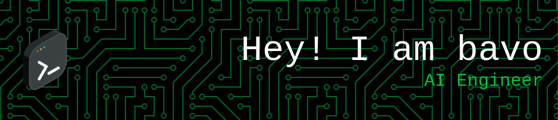

An aspiring AI Engineer with a background in Artificial Intelligence, Machine Learning, and Computer Vision. A fast learner who delved into knowledge and was dedicated to producing good quality service.

- 📫 Reach me at **bavo.imp@gmail.com**

## Languages and Tools

